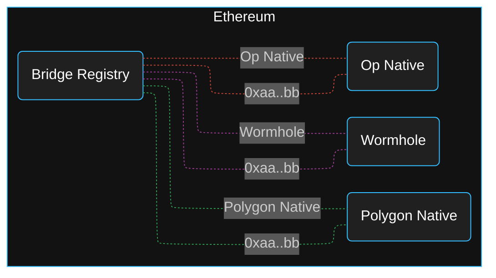
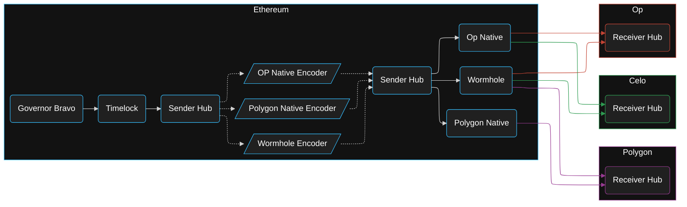
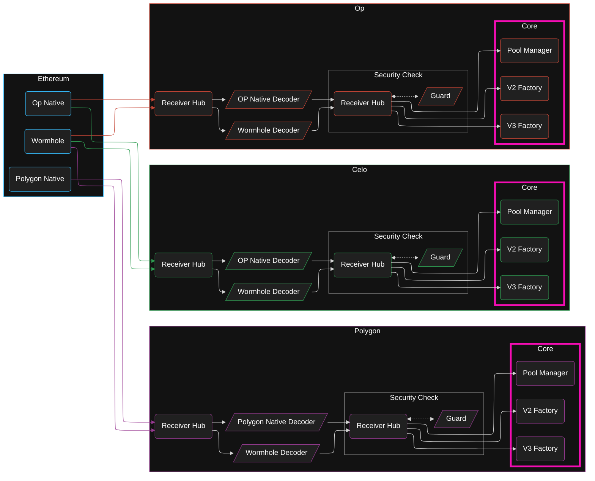
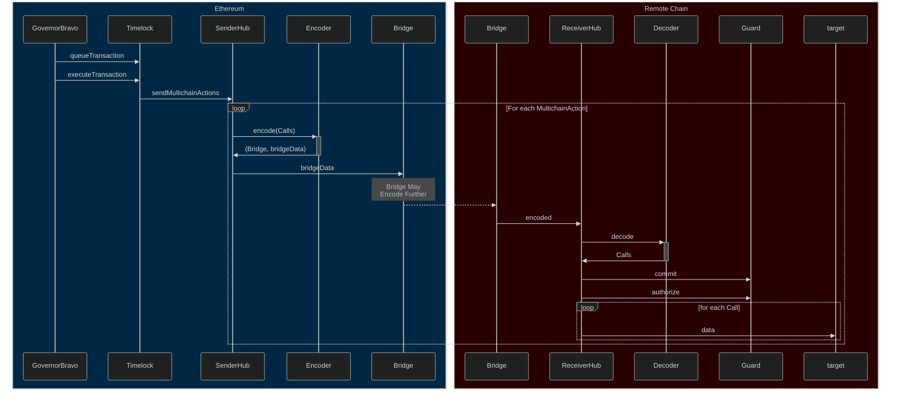

# Modular Multichain Governance

Modular multichain message passing infrastructure for Uniswap Governance actions.

Bridge architectures and interfaces vary widely. This creates rifts between what governance signs
and what actually gets run on each chain. Defining an encoder-decoder layer separates the "calls
that need to run" from the "details of how this specific bridge works".

## Overview

To make the foundation concrete, we need governance to sign a collection of `Call`'s to be run on an
arbitrary chain. These `Call` items has a target address, a value (in ether) to send, and a calldata
payload to send use. Bridges use different interfaces and encodings to send and receive messages,
which we must account for. Bridges also serve as central points of failure in terms of security and
liveness. When security fails, invalid messages can be sent to our receiver contract. When liveness
fails, we cannot get messages to our receiver contract at all.

Everything we define below is directly in service of getting an array of `Call`'s from Ethereum to a
remote chain while solving for encoding, decoding, backstopping bridge security failures, and
mitigting bridge liveness failures.

### Bridge Registry

First, we define a `BridgeRegistry`. Authorizing the use of a given bridge requires the storage of a
unique identifier of the bridge. This identifier is derived from the hash of the bridge name and
stored on the `BridgeRegistry` with a two way lookup to avoid spelling ambiguity (ie "is it 'Op' or
'OP'?"). If it exists on the registry, it is correct.



### Sender Hub

For sending messages from Ethereum, we define a `SenderHub`. This must be able to not only send a
message to any chain, it must be able to do so over any available bridge that passes Uniswap
Foundation's assessment. Therefore, we define a `MultichainAction` which contains a unique chain
identifier, a unique bridge identifier, and a collection of `Call`'s.

For a given chain and bridge, we must encode the `Call`'s before sending them over
the bridge, so governance stores an `Encoder` contract address for each chain-bridge pair which can
encode the `Call`'s and direct `SenderHub` to which bridge address must be called. Often, but not
always, the same `Encoder` logic can be re-used for the same bridge targeting different chains
(Wormhole targeting Celo vs Wormhole targeting Polygon).



### Receiver Hub

For receiving messages to a remote chain, we define a `ReceiverHub`. This must be able to receive a
message from Ethereum over any available bridge that passes Uniswap Foundation's assessment. The
actual encoded calldata received varies by bridge, so we use the catch-all `fallback` function to
handle arbitrary calldata payloads from any given bridge.

For a given bridge forwarding a message to the `ReceiverHub`, the `RecevierHub` looks up a `Decoder`
associated with that bridge address. If it does not exist, the bridge is not authorized, so it
reverts. If it does exist, it forwards the bridge address, call value, and calldata into the
`Decoder`, which returns the decodes the data into the array of `Call`'s that was sent by the
`SenderHub`. After this, the `Call`'s are placed into staging where they may only be run after the
prerequisite security checks are performed.

> Context: **All bridged data is untrusted user input until proven otherwise.**

Different bridges and chains require different threat models, so we generalize over them using a
custom `Guard` contract, akin to Gnosis Safe's Guard modules.

When `ReceiverHub` receives a message from a bridge, it decodes it into `Call`'s, notifies the
`Guard` of which bridge called and what the decoded `Call`'s are, then places the `Call`'s into a
staging ground to be executed in another call.

When the `Call`'s are to be run, the `ReceiverHub` notifies the `Guard` and requests authorization
to run them. If `Guard` reverts, `ReceiverHub` must also revert. If `Guard` authorizes, then
`ReceverHub` iterates through the `Call`'s one by one.



### Message Flow

Message flow is as follows:

- `GovernorBravo` queues a transaction on `Timelock`
- time passes
- `GovernorBravo` executes a transaction on `Timelock`
- `Timelock` sends the multichain actions to `SenderHub`
- for each multichain action:
  - `SenderHub` loads the `Encoder` for the multichain action
  - `SenderHub` sends the `Call` array to `Encoder`
  - `Encoder` returns the encoded data and bridge address
  - `SenderHub` calls the bridge with the encoded data
  - **bridge magic**
  - `ReceiverHub` is called by a bridge
  - `ReceiverHub` sends the encoded data to the `Decoder` for that bridge
  - `Decoder` returns the decoded `Call` array
  - `ReceiverHub` commits to this `Call` array on `Guard`
  - in another transaction
  - `ReceiverHub` is called to run the staged `Call` array
  - `ReceiverHub` calls `Guard` for authorization
  - `Guard` authorizes
  - `ReceiverHub` loops the `Call` array and dispatches those calls



### API Sketch

```solidity
// Call type to be run
struct Call {
    address target;
    uint256 value;
    bytes data;
}

// Calls to be dispatched over a chain and bridge
struct MultichainAction {
    uint256 chainId;
    bytes32 bridgeId;
    Call[] calls;
}

// Sender Hub function to send the message
function sendMultichainActions(MultichainAction[] calldata actions) external;

// Receiver Hub function to run the calls
function runCalls() external;
```
