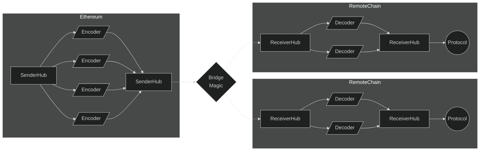

# Modular Multichain Governance

Modular Multichain Governance is a system to pass messages from Ethereum L1 to L2's and other L1's
based on Uniswap governance decisions.

We define a `SenderHub` on Ethereum and a `ReceiverHub` on remote chains (L2's or other L1's), which are used to
abstract underlying bridge details for sending messages. The bridge details are abstracted by `Encoder` and `Decoder`
modules.

## Sending Messages

The `SenderHub` assigns an `Encoder` module for a given remote chain (by its `chainId`). When the `SenderHub` is called
by governance, it receives a list of multichain actions's. Each multichain action is a list of calls and a target chain
Id. For each multichain action, the `SenderHub` dispatches the respective `Encoder` for that chain, then the `Encoder`
returns to the `SenderHub` an address, call value, and encoded calldata such that the `SenderHub` can initiate the
bridge call. This ensures the `SenderHub` is always the caller on L1.

## Receiving Messages

The `ReceiverHub` assigns a `Decoder` module for a given calldata payload (by its selector). When the `ReceiverHub` is
called, it dispatches the encoded data to the respective `Decoder`, then the `Decoder` validates the data, decodes it,
and returns the originally sent list of calls for `ReceiverHub` to run. This ensures the `ReceiverHub` is always the
caller on the remote chain.

